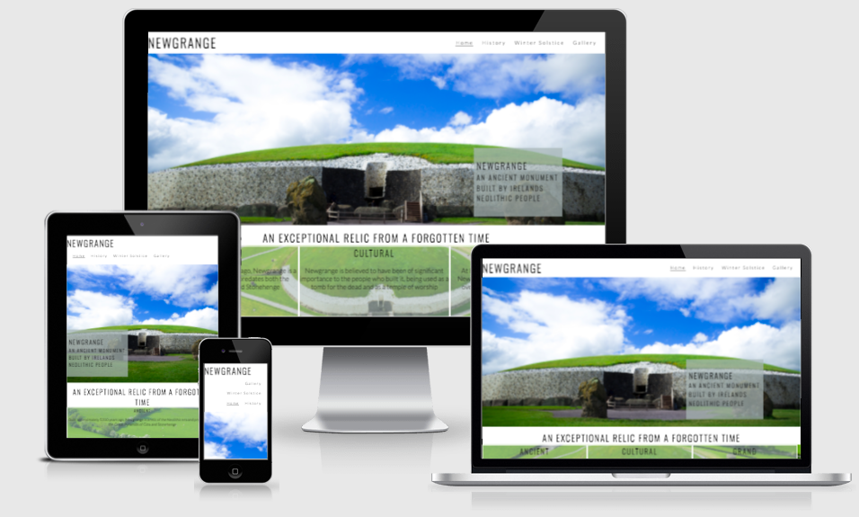
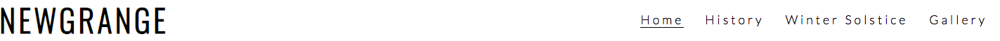
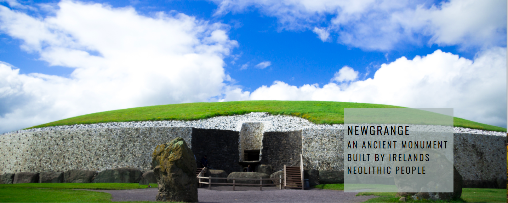
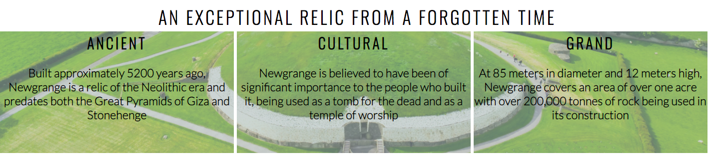
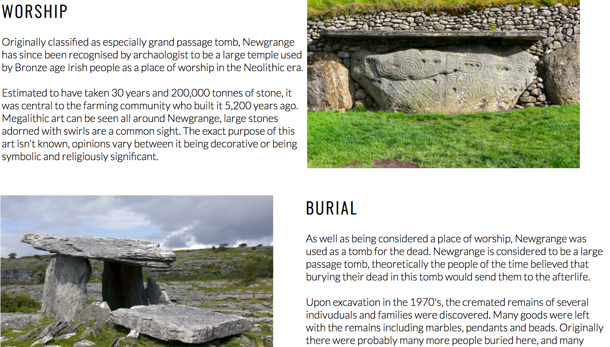
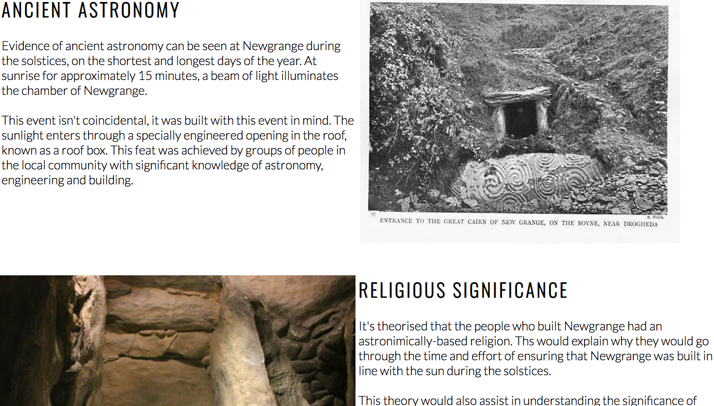
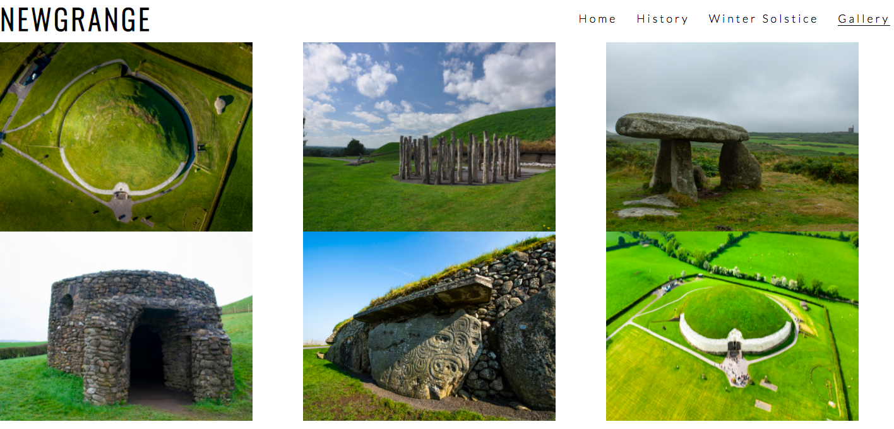

<h1>Newgrange Monument</h1>
 

 

The purpose of the Newgrange website is to provide information to tourists and history enthusiasts. It provides a brief history of the monument and its cultural signiicancne, alongside a gallery of related images. Users can also find information related to booking tours and entering the winter solstice lottery

 

<h2>Features</h2>
 
<h3>Navigation</h3>

<ul>
<li>Featured on the top right of the screen are links to the home, history, winter solstice, and gallery pages</li>
<li>The links move from inline with the logo on desktop, to underneath it on mobile devices</li>
<li>The black font contrast with the white background, making it easier to read</li>
<li>The active page is underlined on the navigation bar</li>
<li>The logo can also be used to link back to the home page</li>
<li>I used the navigation code from the Love Running walkthrough project</li>
</ul>

 

<h3>Header</h3>

<ul>
<li>The header shows an image of Newgrange and a remark about the monument to introduce it to the user</li>
<li>The covertext contrasts the image and is placed on a transparent background to make it easier to read</li>
</ul>

 

<h3>About Newgrange Section</h3>

<ul>
<li>This portion of the website gives a broad overview of Newgrange</li>
<li>Its provided into three sections, "Ancient", "Cultural", and "Grand"</li>
<li>These sections sit beside eachother on desktop and stack ontop of eachother on mobile</li>
<li>It overlays another picture of Newgrange, and the contrasting text again sits on a transparent background for ease of reading</li>
</ul>

 

<h3>Visit Newgrange Section</h3>

<ul>
<li>This section provides information about location and where to buy tour tickets</li>
<li>This portion of the website is also split into three sections, two dedicated to different tours and one for location</li>
<li>There is also an embedded google map link</li>
<li>These sections sit beside eachother on desktop and stack ontop of eachother on mobile</li>
<li>The black font contrast with the white background, making it easier to read</li>

</ul>

 

<h3>History and Winter Solstice</h3>
 
<ul>
<li>The History and Winter Solstice pages follow the same layout as eachother for continuity purposes</li>
<li>These pages give the reader a brief overview of the history of Newgrange </li>
<li>Two paragraphs of text are layed out beside images relevant to the information</li>
<li>The text and images contrast with the background for ease of reading and viewing</li>
<li>On mobile, the images and text stack on top of each other</li>

</ul>

 

<h3>Gallery</h3>

<ul>
<li>The gallery shows a few images relevant to Newgrange</li>
<li>The images are layed out neatly at appropriate wdiths and heights so as not to appear stretched</li>
<li>The images stack on top of each other on mobile</li>
<li>The images contrast with the white background for ease viewing</li>

</ul>